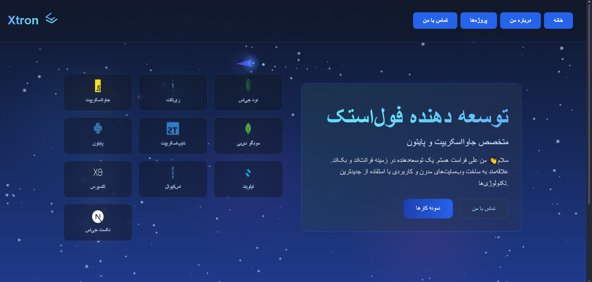

# 🚀 Xtron Portfolio Website

## ✨ Overview

A modern, responsive portfolio website built with React and TailwindCSS. Features smooth animations powered by Framer Motion and a sleek, professional design.

## 🎯 Features

- 🌟 Interactive UI with smooth animations
- 📱 Fully responsive design
- 🌙 Space-themed background
- 📂 Project showcase section
- 📝 Contact form
- 🎨 Modern and clean design

## 🛠️ Built With

- React.js
- TailwindCSS
- Framer Motion
- React Icons
- React Router

## 🖼️ Preview

## 🔗 Live Demo

Check out the live website: [Xtron Portfolio](https://alixtron0.github.io/xtronWebsite)

## 📄 License

This project is licensed under the MIT License.

---
⭐ If you like this project, give it a star!
